# Laboratorio5-Robotica-2023_2
# Cinemátia inversa usando el Phantom X

* Juan Nicolás Carvajal Useche
* Edgar Giovanny Obregón Espitia
  
## Introducción
La mayoría de las aplicaciones en robótica se fundamentan en la determinación de rutas necesarias para guiar un manipulador dentro de su área de operación, definiendo diversas configuraciones mediante el conocimiento de la posición y orientación de su herramienta de trabajo. En este contexto, la resolución del problema cinemático inverso se ocupa de calcular las posiciones angulares del manipulador, facilitando así su control a través de un entorno de desarrollo software. En este laboratorio, se realizó la solución del modelo cinemático inverso para el robot PhantomXPincher de manera geométrica, mediante este modelo, se programaron una serie de trayectorias a través de MATLAB con el fin de ser dibujadas por el robot. Se mostrará el procedimiento para hallar este modelo, el procedimiento de programación mediante ROS y Python del robot, los resultados obtenidos y un análisis de estos incluyendo métricas de precisión y repetibilidad.

## Modelo cinemático inverso

Para hallar el modelo cinemático inverso, se realizó una solución geométrica

#### Articulación q1

$\theta_1$ depende solo de los valores de posición en dirección $x$ y $y$, ya que es la única articulación que actúa así, por lo que se tiene que:

```math
\theta_1=atan2(P_y,P_x)
```

#### Desacople de la muñeca

Con el objetivo de reducir la cantidad de variables, se realiza un desacoplamiento de la muñeca de la última articulación. En consecuencia, la posición del Punto de Control de la Herramienta (TCP) se desplaza una distancia de $-L_4$ en la dirección del vector de aproximación. Finalmente, la posición de la muñeca se calcula mediante la siguiente fórmula:

```math
w=
\begin{bmatrix}
    x_T\\
    y_T\\
    z_T
\end{bmatrix}
-L_4
\begin{bmatrix}
    a_x\\
    a_y\\
    a_z
\end{bmatrix}
```

donde $a_x$, $a_y$ y $a_z$ son las componentes del vector de aproximación en el marco de referencia del eslabón base, y estas componentes pueden obtenerse a partir de la matriz de rotación del TCP.

#### Mecanismo 2R
Con todas estas simplificaciones realizadas, el problema de la cinemática inversa del robot se reduce a un mecanismo 2R. Este mecanismo tiene dos soluciones posibles: con el codo hacia arriba y con el codo hacia abajo.

<p align="center">
  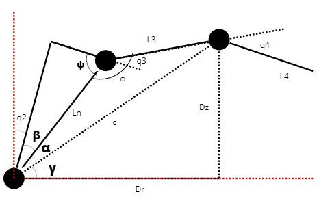
</p>

```math
\begin{gather*}
    r = \sqrt{x_w^2+y_w^2}\\
    h = z_w-L_1\\
    \\
    c = \sqrt{r^2+h^2}\\
    \\
    \beta = \arctan2{(L_m,L_2)}\\
    \psi = \frac{\pi}{2}-\beta\\
    L_r = \sqrt{L_m^2+L_2^2}\\
    \\
    \phi = \arccos{\frac{c^2-L_3^2-L_r^2}{-2L_rL_3}}\\
    \\
    \gamma = \arctan2{(h,r)}\\
    \alpha =  \arccos{\frac{L_3^2-L_r^2-c^2}{-2L_rc}}
\end{gather*}
```
#### q2 y q3 (Hombro y codo)
Para definir las soluciones con el codo hacia arriba y hacia abajo, se utilizan las siguientes ecuaciones:

Por convenciencia, para este laboratorio se selecciona la solución codo arriba del modelo, entonces:

```math
    \mathbf{q_2}  = \frac{\pi}{2}-\beta-\alpha-\gamma \\
    \mathbf{q_3} =           \pi-\psi-\phi  
```
Desarrollando estas ecuaciones se tendría que:

```math
\begin{align*}
    \theta_2 &= -2 \arctan\left(\frac{2D_rL_2 - \sqrt{-D_r^4 - 2D_r^2D_z^2 + 2D_r^2L_2^2 + 2D_r^2L_3^2 - D_z^4 + 2D_z^2L_2^2 + 2D_z^2L_3^2 - L_2^4 + 2L_2^2L_3^2 - L_3^4}}{D_r^2 + D_z^2 + 2D_zL_2 + L_2^2 - L_3^2}\right)\\
    \theta_3 &= -2 \arctan\left(\frac{\sqrt{(-D_r^2 - D_z^2 + L_2^2 + 2L_2L_3 + L_3^2)(D_r^2 + D_z^2 - L_2^2 + 2L_2L_3 - L_3^2)} - 2L_2L_3}{D_r^2 + D_z^2 - L_2^2 - L_3^2}\right)
\end{align*}
```

Donde:

```math
\begin{align}
    D_r=\sqrt{P_x^2+P_y^2}-L_4 cos(\beta): Distancia r (radial de los dos eslabones)\\
    D_z=P_z-L_4 sin(\beta)-L_1: Distancia en Z de los dos eslabones\\
\end{align}
```

#### Articulación de la muñeca (q4)

Una vez que se han definido los ángulos de la cintura, hombro y codo, se vuelve a conectar la muñeca y se define el ángulo de la muñeca de la siguiente manera:

```math
\begin{gather*}
    \theta_a=\arctan2{\left(\sqrt{x_a^2+y_a^2},z_a\right)}\\
    q_4=\theta_a-q_2-q_3-\frac{\pi}{2}
\end{gather*}
```
Donde esta parametrización está determinada por los valores de las dos articulaciones anteriores, y el ángulo de ataque deseado de la articulación final. Este modelo se programó en Matlab para hallar los valores de las articulaciónes para diferentes trayectorias, esto se puede ver en el código anexo.


## Portaherramienta y gripper cyberpunk

Con el fin de fijar la posición del marcador en el espacio de trabajo para su carga y descarga, y para asegurar el agarre en el gripper cuando dibuje, se diseñaron dos piezas, una para sostener la herramienta con el gripper, y otra para sostener el marcador en el tablero. A continuación se muestran imágenes de este par de herramientas.

<p align="center">
  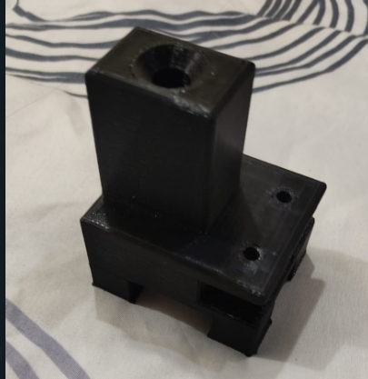
</p>

<p align="center">
  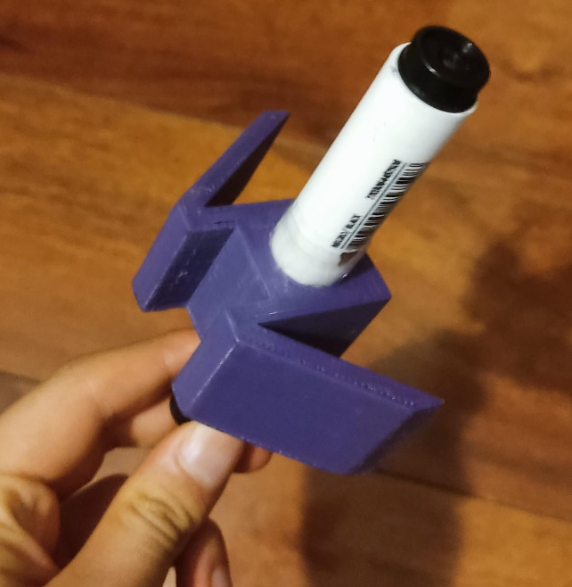
</p>

Se observa que toma la forma del gripper para tener mejor sujeción y para que se vea con más estilo.

## Rutinas programadas

Las rutinas programadas para dibujar seguían la siguiente secuencia:

* Posición inicial en home: q = [0,0,0,pi/2,0\].
* Primera trayectoria de aproximación al punto inicial de la figura, letra o trazo a dibujar, esta aproximación se hace llevando el marcador a la coordenada XY de este punto, pero con un Z arriba del tablero.
* Trayectoria de aproximación al tablero, donde se deja fijo el XY del punto inicial, y se baja Z con una cantidad de puntos especificados.
* Inicio de la rutina de dibujo, donde dependiendo de los trazos (ya sean las iniciales, figura, o workspace) se dibujan estos hasta llegar al punto final del dibujo.
* Trayectoria de alejamiento del tablero, donde se deja XY constante y se sube en Z para alejarse del tablero con n cantidad de puntos.
* Regreso a home, donde tras subir y terminar el dibujo el robot vuelve a home.

Adicional a estas, se programaron dos rutinas para la carga de la herramienta, que seguían la secuencia:

* Posición inicial en home: q = [0,0,0,pi/2,0\].
* Punto de acercamiento a la herramienta.
* Aproximación horizontal al soporte del marcador.
* Cierre del gripper para la sujeción del marcador.
* Alejamiento en el eje z hacia arriba para sacar el marcador del portaherramienta.
* Regreso a home.

Y para la descarga fue similar a la anterior rutina pero invertida, para esto se hizo un ciclo for donde se recorría esta rutina pero de atrás para adelante. Para ver las rutinas más detalladamente, **dirigirse al matlab "CI_Trayectorias_Phantom_Lab.mlx", donde se encuentra implementado todo**.

### Espacio de trabajo
Los puntos para la rutina del espacio de trabajo consistieron en 2 circunferencias de diferente radio parametrizadas en coordenadas polares. En este caso, se escogió el barrido en un rango de ángulo de [-60°,60\] con un radio exterior de 280mm y un radio interior de 165mm. Esto se programó en matlab y la trayectoria teórica se muestra en la imagen a continuación.

<p align="center">
  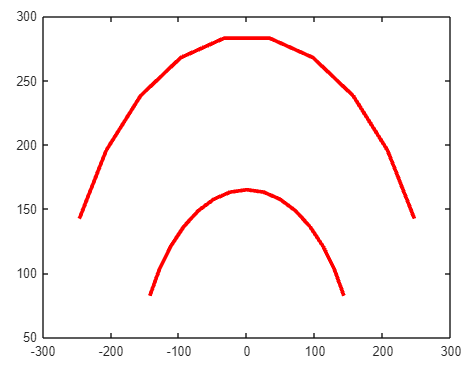
</p>

Se implementó una función para generar los puntos en matlab, luego, a través de un bucle for se realizó la cinemática inversa de cada punto.

### Iniciales

Se hicieron los trazos para la letra N y G, como adición, se aplicó una matriz de rotación para la letra G. Se hizo usando trazos rectos. De igual manera, tras generar los trazos se realizó la cinemática inversa de cada punto y se guardó todas las posiciones en un único vector. La imagen a continuación muestra las letras.

<p align="center">
  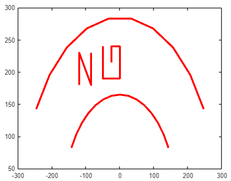
</p> 

### Figura libre

Se programaron los trazos para dibujar una carita feliz, como los demás casos, tras generar los puntos se hizo un for para obtener los valores de las articulaciones usando la cinemática inversa. La figura se muestra en la imagen a continuación.

<p align="center">
  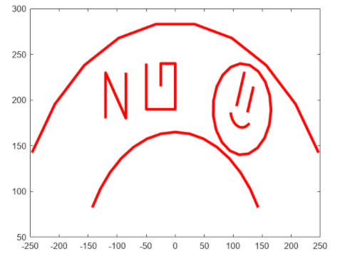
</p>

## Envío de Rutinas al Robot con el Script de Python

En esta sección, describimos el proceso de envío de rutinas al robot mediante un script en Python.

### Carga de Posiciones de Trayectorias

En primer lugar, se cargan las posiciones de cada una de las trayectorias por separado. Este enfoque se elige para lograr un control más efectivo de las velocidades de los trazos. Además, es esencial agregar las direcciones de estos archivos al archivo `CMakeLists.txt` para su integración adecuada.


### Desarrollo de Funciones para Instrucciones

Se desarrollan funciones específicas para la ejecución de cada instrucción. Estas funciones tienen en cuenta el estado de la herramienta, ya sea cargada o descargada, para permitir la continuación de las trayectorias. Durante la ejecución, se visualizan las posiciones del mecanismo, y al completar las trayectorias, se actualizan el tiempo de ejecución y la imagen correspondiente.


Este procedimiento se repite para cada una de las instrucciones, asegurando un control detallado y preciso de las acciones del robot durante la ejecución de las rutinas.


## Creación de la Interfaz

La interfaz de usuario fue diseñada con la finalidad de proporcionar una experiencia intuitiva y eficiente para el control del sistema. Se implementaron seis botones clave, cada uno con una función específica:

1. **Cargar Herramienta:** Permite cargar la herramienta de manera automatica.

2. **Descargar Herramienta:** Permite descargar la herramienta de manera automatica.

3. **Dibujar Espacio de Trabajo:** Inicia la creación y definición del espacio de trabajo para el robot.

4. **Dibujar Iniciales:** Crea las iniciales de los dos participantes G y N.

5. **Dibujar Figura:** Posibilita la creación de la figura seleccionada.

6. **Botón de Parada de Emergencia:** Permite una detención inmediata del sistema en situaciones críticas.


La disposición de la interfaz se presenta de manera organizada. En la parte superior, se muestran los nombres de los integrantes del equipo. El centro de la interfaz exhibe imágenes relevantes, con la imagen actual a la derecha y la imagen anterior a la izquierda. La información temporal de cada rutina, la posición actual del robot y el estado de la herramienta se presentan claramente a la derecha. En la parte inferior se encuentran los seis botones que permiten un control directo y rápido de las funciones esenciales.


Video de la interfaz


https://github.com/jcarvajalu/Laboratorio5-Robotica/assets/82681128/bc9d2299-45c1-4ac3-ae11-0f6e50d8b618


Ver en mejor calidad.
https://github.com/jcarvajalu/Laboratorio5-Robotica/blob/main/VideosC/py_int.mp4

## Resultados

Los resultados de esto se pueden ver en los siguientes videos. Dada la extensión del video, se divide en 3 partes.


https://github.com/jcarvajalu/Laboratorio5-Robotica/assets/82681128/9f88d37d-2bf2-40fd-a2f5-391a04a2ebac


[Parte 1 de la demostración de las trayectorias](VideosC/video11.mp4)\\


https://github.com/jcarvajalu/Laboratorio5-Robotica/assets/82681128/514dc855-fb96-4322-9d55-24a621a2fd20


[Parte 2 de la demostración de las trayectorias](VideosC/video12.mp4)\\


https://github.com/jcarvajalu/Laboratorio5-Robotica/assets/82681128/f4489581-ff74-4529-8819-355d201604ac


[Parte 3 de la demostración de las trayectorias](VideosC/video13.mp4)

Dado que se pasó por alto algunos requerimientos de la interfaz gráfica, se modificó la interfaz que ya se tenía implementada ajustando estos requerimientos, la interfaz implementada completa se muestra en el siguiente video. Además, en este video se muestra una parte del análisis de repetitividad de trazos, donde se muestra el tablero ya con los trazos y la repetición de algunas rutinas. No se muestra todo el análisis puesto que el video quedaría muy extenso.


https://github.com/jcarvajalu/Laboratorio5-Robotica/assets/82681128/5e4175cf-303d-4cc3-a282-9a0291bc30d3


[Parte 2 de la demostración de la interfaz](VideosC/video2.mp4)

Si se desea en mejor calidad, o verlo completo, estos enlaces a drive llevan a los videos originales.
[Video 1 completo](https://drive.google.com/file/d/1mVLsCQgf-roHZgIybspF34zE0Ja-_5TJ/view?usp=sharing)
[Video 2 completo](https://drive.google.com/file/d/1mJYiuvhlkB-AvkS0WVh9bYA1bAqFMY7F/view?usp=sharing)

Se observa que se implementaron todos los requerimientos en la interfaz gráfica y se realiza la secuencia de rutinas solicitada. El resultado de los trazos repetidos se muestra en la siguiente imagen. Se hizo una corrección de perspectiva dado que la superficie del tablero debe quedar lo más perpendicular a la cámara para que se tengan los resultados más reales.

<p align="center">
  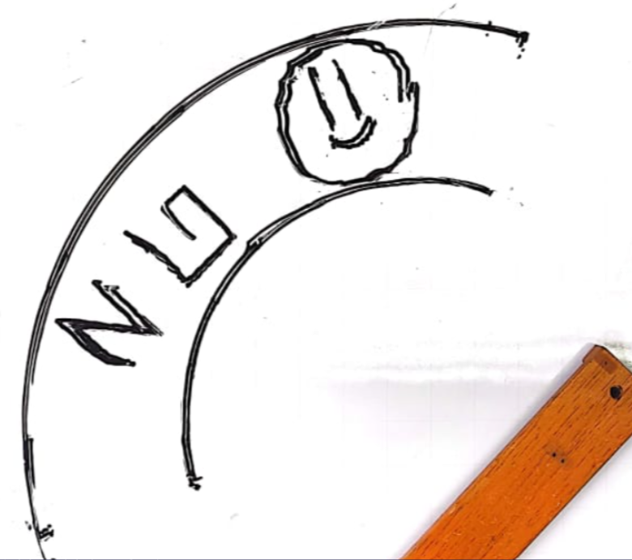
</p>

## Análisis de resultados

### Tiempos de ejecución

Los tiempos de ejecución de cada rutina se resumen en la siguiente tabla.

| Rutina | Tiempo (s) |
| ------------- | ------------- |
| Carga de herramienta  | 52 |
| Workspace  | 75  |
| Iniciales  |  110 |
| Figura libre  |  55 |
| Descargar herramienta  | 52  |

### Calidad del trazo y verificación dimensional de las figuras dibujadas

Ahora, se comparará cada trazo de cada rutina respecto al valor real, se tomará la desviación de os trazos generados en las rutinas identificado por computadora. La imagen a continuación muestra la comparación de esto.

<p align="center">
  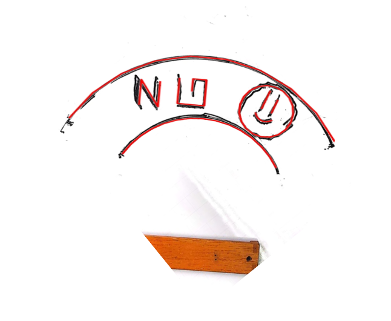
</p>

A través de la librería OpenCV en Python, las imágenes fueron comparadas usando el patrón de calibración de la cámara del celular, exportando las imágenes calibradas teniendo en cuenta que el trazo rojo es producto de una operación dilatación usando _cv2.dilate_, y se segmentó este trazo, luego, se umbralizó la imagen del tablero tomada con la cámara usando _cv2.threshold_ utilizando un umbral de 225, se segmentó también y calibrando esta imagen y sumándolas se obtuvo la intersección de las dos imágenes. Tras esto, se dispuso a hacer las cotas para la verificación dimensional generando los siguientes resultados.

#### Trayectoria del workspace

Se tomaron las desviaciones de el radio de curvatura y de la distancia entre punto de inicio y final. Los resultados se muestran en la siguiente tabla.

<p align="center">
  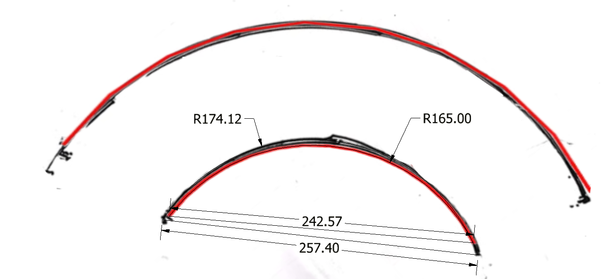
</p>

<p align="center">
  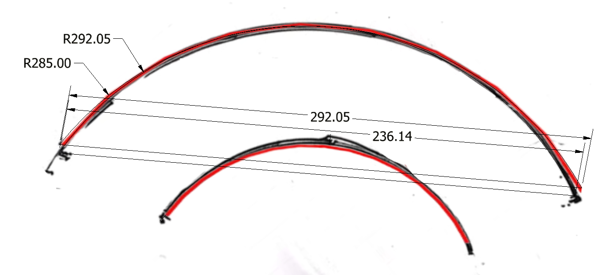
</p>

| Trazo | Valor real (mm) | Valor del dibujo (mm) | Error relativo del trazo (%)|
| ------------- | ------------- | ------------- | ------------- |
| Radio interno | 165  | 174.12 | 5.779  |
| Radio externo | 285  | 283.11 | 0.668 |
| Longitud RI | 242.57  | 257.40  | 5.761 |
| Longitud RO | 482.57  | 489.77  | 1.470 |

Se observa que esta figura la hace considerablemente bien incluso cuando se repiten los trazos, se observa que al inicio de la trayectoria existe una línea atípica no programada, pero esto se debe a que cuando el marcador baja, se choca inicialmente contra el tablero y después se acomoda el gripper, por lo que este choque pequeño genera estos trazos que también se verán en otras figuras. El trazo con mayor error fueron los del radio interno, esto puede deberse a la posible mala inclinación que sufre el gripper al estar pegado a su base, mientras que el radio exterior lo dibujó mejor. 

#### Trayectoria iniciales

Del mismo modo, los resultados para estos trazos son:

<p align="center">
  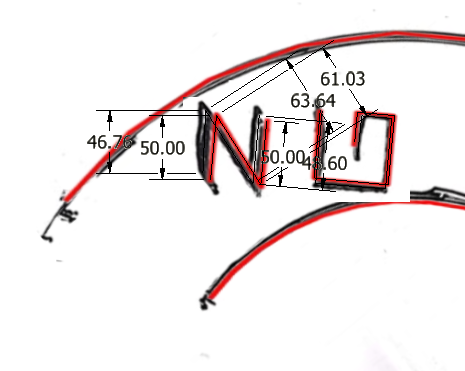
</p>

<p align="center">
  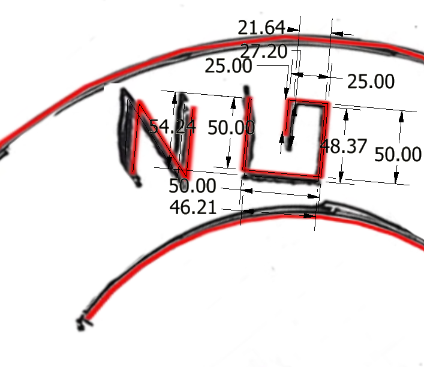
</p>

| Trazo | Valor real (mm) | Valor del dibujo (mm) | Error relativo del trazo (%)|
| ------------- | ------------- | ------------- | ------------- |
| Trazo 1: Letra N | 50  | 46.76 |  6.92 |
| Trazo 2: Letra N | 61.03  | 63.64 | 4.1 |
| Trazo 3: Letra N | 50  | 48.60 | 2.88 |
| Trazo 4: Letra G | 50  | 54.24 | 7.8171 |
| Trazo 5: Letra G | 50  | 46.21 | 8.201 |
| Trazo 6: Letra G | 50  | 48.37 | 3.369 |
| Trazo 7: Letra G | 25  | 21.64 | 15.52 |
| Trazo 8: Letra G | 25  | 27.2 | 8.02 |

Se observa que la letra G la hace mejor que la letra N, aquí ocurre el mismo fenómeno, que el primer trazo debe corregir la trayectoria desde el punto de inicio, dimensionalmente se observa que la letra es similar, pero no coinciden en la posición como tal. La letra G se dibuja de una mejor manera en el sentido que se encuentra mejor en su posición, pero se observa una gran desviación en el trazo 4 y trazo 5, que son los trazos más cortos, esto puede deberse a posibles efectos circunstanciales como el desajuste del marcador en este punto debido a que la punta no es plana, a la transición entre trazos, insuficiencia de puntos, entre otros. Otra cosa a atribuir es que el marcador pudo haberse movido un poco debido a la escritura o choques con el tablero, lo cual genera inexactitudes en los trazos dibujados.

#### Trayectoria figura libre

Ahora, para la figura libre se tiene:

<p align="center">
  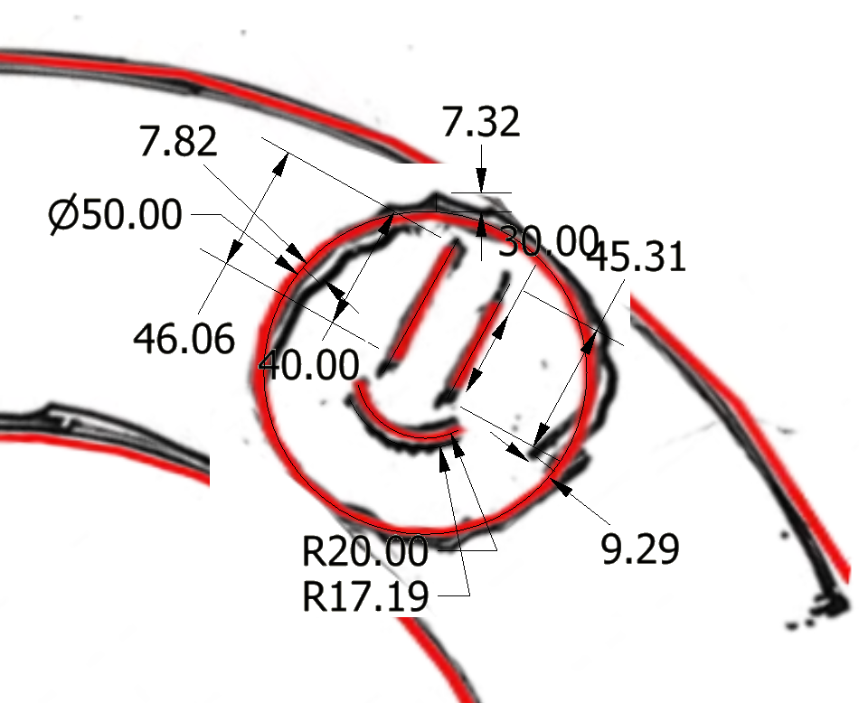
</p>

En este caso, dado que la circunferencia dibujada difería por el análisis de repetitividad, el software implementado en OpenCV no lograba definir una circunferencia representativa de estos dibujos, como alternativa, se comparó con 3 puntos de mayor desviación al diámetro de la cara, obteniendo así los siguientes resultados.

| Trazo | Valor real (mm) | Valor del dibujo (mm) | Error relativo del trazo (%)|
| ------------- | ------------- | ------------- | ------------- |
| Trazo 1: Ojo 1 | 40  | 46.06 | 13.15 |
| Trazo 2: Ojo 2 | 30 | 45.31 | 33.78 |
| Trazo 3: Radio boca | 20  | 17.19 | 16.34 |
| Trazo 4.1: Diámetro cara (d=7.82)|  40 | 47.82 | 16.35 |
| Trazo 4.2: Diámetro cara (d=7.32)| 40  | 47.32 | 15.469 |
| Trazo 4.3: Diámetro cara (d=9.29)| 40  | 49.29 | 17.84 |

Se observa sin dudas que esta figura es la que mayores desviaciones de su trayectoria presentó, la principal razón que se discutió es que dado que es la última rutina que se ejecuta, es en la que el marcador se encuentra más desplazado o desviado debido a los anteriores trazos (fricción por estos), golpes acumulados al bajar al tablero para dibujar, en general, mayor acumulación de perturbaciones en el gripper que pudieron haber movido el marcador indeseablemente. Adicionalmente, se observa que la circunferencia dibujada podría mejorarse añadiendo más puntos de dibujo o incluso haciendo una interpolación diferente para la cinemática inversa del cálculo de estos perfiles de posición de los servos del robot.

### Exactitud de los trazos

Habiendo verificado las dimensiones de los trazos y analizados esos resultados, se procede a evaluar la exactitud del trazo como tal, es decir, qué tan cerca o lejos están las posiciones de los trazos dibujados respecto a los teóricos, para esto se utiliza la métrica intersección sobre unión (IoU) usada en el procesamiento de imágenes y en redes neuronales. Intersección sobre unión tiene el siguiente algoritmo:

* 1. Umbralización de las imágenes a comparar: Las imágenes de entrada son umbralizadas para que sus valores sean o blanco o negro.
* 2. Reescalamiento o preprocesamiento para ajustar ambas imágenes: Se ajustan las imágenes con el patrón de calibración de cámara y de punto inicial para sobreponerlas, en este punto, no importa que se alteren las dimensiones de los trazos, únicamente se requiere coincidir las imágenes en un punto y una orientación según la calibración, se escoge como punto inicial el punto más a la izquierda (primer punto del workspace).
* 3. Cálculo de intersección: Ajustadas las imágenes, se calcula el número de bits que están en intersección de ambas imágenes, esto corresponde al un valor representativo de qué tantos bits de imágenes se corresponden entre los trazos teóricos vs los reales. Para esto se hace uso de la función _cv2.bitwise_and_ (una función and A&B) implementada en la librería usada.
* 4. Cálculo de unión: Sabiendo el número de bits que se corresponden, ahora se debe saber el número de bits totales de la imagen para tener la referencia, esto se hace usando la función _cv2.bitwise_or_, que calcula el número de bits totales entre ambas imágenes sin incluir los bits intersectados.
* 5. Aplicación del algoritmo: Se aplica el algoritmo:


\[ IoU = \frac{\text{Área de Intersección}}{\text{Área de Unión}} \]

La puntuación de IoU varía de 0 a 1, donde 0 indica ninguna superposición y 1 indica una superposición completa. Esta métrica es crucial para evaluar la calidad de las predicciones en tareas de matching.

El código implementado se encuentra anexo en el repositorio. Los resultados de cada rutina se muestran en la siguiente tabla.

| Trazo | Valor IoU |
| ------------- | ------------- |
| Workspace | 0.8489  | 
| Iniciales | 0.69851 | 
| Figura libre | 0.615689  |

Se observa que los trazos que mejor matching espacial tienen son los del workspace, esto se puede observar también a simple vista, adicionalmente, este valor también demuestra que este trazo tiene una alta repetitividad, puesto que a pesar de haberlo trazado 5 veces tiene el mayor valor IoU. Una justificación adecuada de esto puede ser el hecho de que para este trazo únicamente se depende de la articulación q1, ya que es simplemente una circunferencia sobre el plano, las demás articulaciones permanecen inmóviles, esto hace que se reduzca la facilidad de trazos falsos o trazos inadecuados. Por otro lado, se observa que las otras dos rutinas poseen un IoU inferior, se observa también que la figura libre es la que menor matching tiene con 0.6156, esto también se debe a lo que se mencionaba anteriormente sobre el número de puntos y el número de perturbaciones acumuladas. Siguiendo esta tendencia, la rutina para las iniciales es el valor "intermedio" de las 3 con 0.69851, sin embargo, se observa visualmente que la letra N tiene más dificultades que la letra G, esto puede deberse a posibles efectos circunstanciales como desniveles u otras causas. También se debe a que los tornillos no estaban completos lo que generaba vibraciones en la base del robot, como se explicaba en los videos.

### Conclusiones

* Se deberían cambiar los tipos de interpolación en la generación de trayectorias para mejorar la calidad de los trazos, además, se podría probar usando distintos números de puntos.
* Se observa que el orden en que se dibujan los trazos afectan la calidad de estos, ya que los trazos previos y las colisiones con el tablero al bajar mueven el marcador y generan pérdidas de exactitud
* Se recomienda para futuras prácticas mejorar la robustez mecánica, apretando tornillos y verificando que no esté desalineado el robot.
